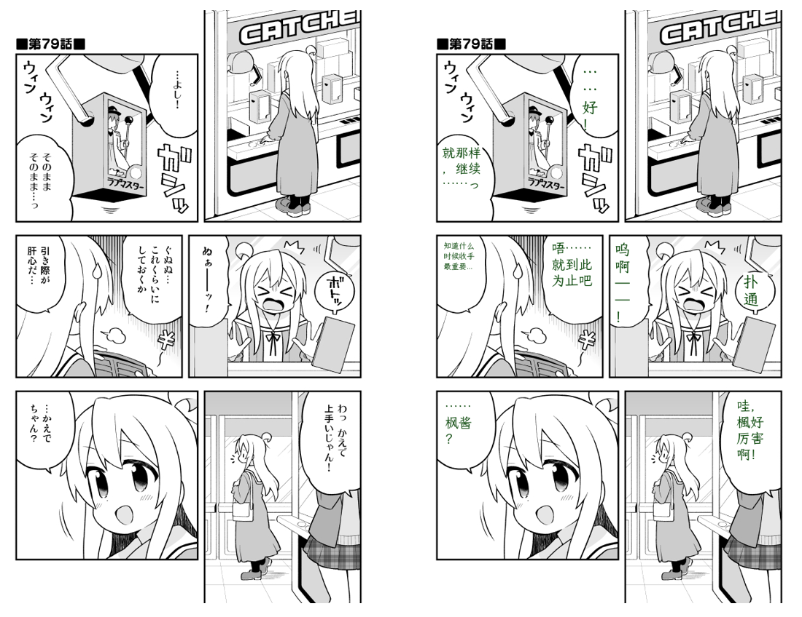

# Moegal Honyaku

Translate Japanese manga into Chinese.

example:



## Project Structure

```text
app/
  api/
    routes/      # FastAPI route handlers
  services/      # OCR / translation / image processing logic
  core/          # config, logger, shared paths
  main.py        # FastAPI app factory and entrypoint

assets/          # models, fonts, demo pictures
saved/           # translated/raw output images
logs/            # runtime logs
main.py          # compatibility entrypoint (exports app.main:app)
```

## Run

```bash
uvicorn app.main:app --reload
```

Compatibility entrypoint still works:

```bash
uvicorn main:app --reload
```

