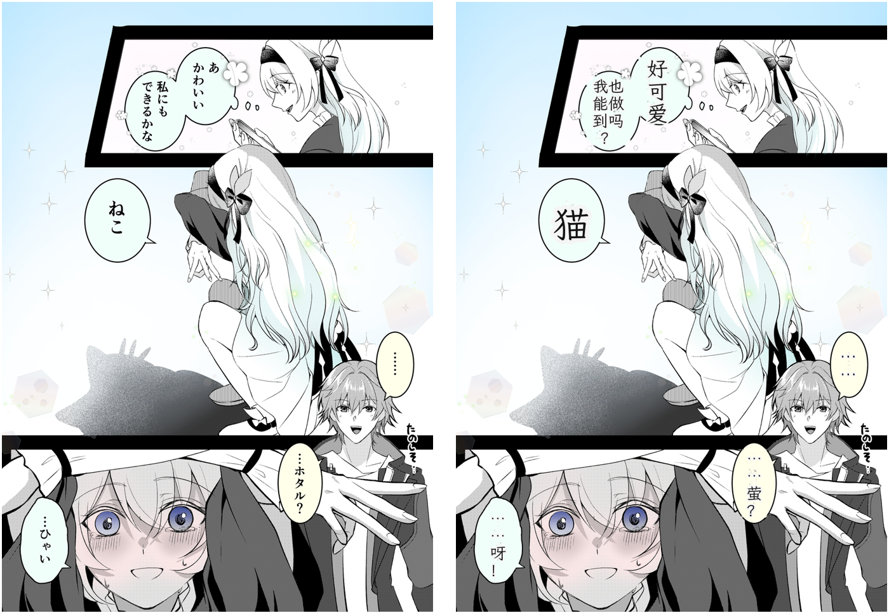

一个日漫图片翻译服务，支持将日文气泡文本自动翻译并回填为中文。

## 项目效果

示例效果：




## 项目部署与使用

### 1. 环境准备

- Python `3.12`
- `uv`

### 2. 安装依赖

在项目根目录执行：

```bash
uv sync
```

### 3. 配置环境变量

在根目录创建 `.env`（或直接修改已有 `.env.example`），至少配置一个可用翻译供应商的 Key：

```env
# OpenAI 方案
OPENAI_API_KEY=your_openai_api_key
# 可选，不填则使用代码默认值
OPENAI_BASE_URL=https://api.openai-proxy.org/v1
OPENAI_MODEL=gpt-5-mini

# DashScope 方案
DASHSCOPE_API_KEY=your_dashscope_api_key
# 可选，不填则使用代码默认值
DASHSCOPE_BASE_URL=https://dashscope.aliyuncs.com/compatible-mode/v1
DASHSCOPE_MODEL=qwen3-max
```

说明：
- 默认配置为 `openai + parallel`。
- 运行时可通过配置接口切换供应商与翻译模式（见下文）。

### 4. 启动服务

```bash
uv run uvicorn app.main:app --reload
```

兼容入口也可用：

```bash
uv run uvicorn main:app --reload
```


### 5. 调用接口

1. 上传图片翻译

```bash
curl -X POST "http://127.0.0.1:8000/api/v1/translate/upload" \
  -F "img=@./assets/pics/example1.png"
```

如不需要返回 `res_img`（base64，体积较大），可关闭：

```bash
curl -X POST "http://127.0.0.1:8000/api/v1/translate/upload?include_res_img=false" \
  -F "img=@./assets/pics/example1.png"
```

2. 通过图片 URL 翻译

```bash
curl -X POST "http://127.0.0.1:8000/api/v1/translate/web" \
  -H "Content-Type: application/json" \
  -d '{
    "image_url": "https://example.com/xxx.png",
    "referer": "https://example.com",
    "include_res_img": false
  }'
```

### 5.1 性能相关参数（可选）

可通过环境变量限制 OCR 并发线程数（默认 `2`）：

```env
OCR_MAX_CONCURRENCY=2
```

3. 配置接口

```bash
# 初始化为默认配置（openai + parallel）
curl -X POST "http://127.0.0.1:8000/conf/init"

# 查询当前配置
curl "http://127.0.0.1:8000/conf/query"

# 查看可选项
curl "http://127.0.0.1:8000/conf/options"

# 更新配置示例：切换到 dashscope
curl -X POST "http://127.0.0.1:8000/conf/update" \
  -H "Content-Type: application/json" \
  -d '{"attr":"translate_api_type","v":"dashscope"}'

# 更新配置示例：切换 structured 模式
curl -X POST "http://127.0.0.1:8000/conf/update" \
  -H "Content-Type: application/json" \
  -d '{"attr":"translate_mode","v":"structured"}'
```

### 6. 输出文件

处理后的文件默认保存到：
- `saved/raw/`：原图
- `saved/cn/`：中文回填图

## 项目结构

```text
app/
  api/
    routes/
      manga_translate.py   # 翻译接口
      update_conf.py       # 运行时配置接口
  services/
    ocr.py                 # 模型加载与 OCR
    translate_api.py       # 翻译供应商调用逻辑
    pic_process.py         # 图像处理与文本回填
  core/
    custom_conf.py         # 运行时配置管理
    font_conf.py           # 字体配置
    logger.py              # 日志
    paths.py               # 路径常量
  main.py                  # FastAPI app 创建入口

assets/
  models/                  # 检测模型与 OCR 模型
  fonts/                   # 绘制中文字体
  pics/                    # 示例图片

saved/                     # 输出目录（raw/cn）
logs/                      # 运行日志
main.py                    # 兼容入口（from app.main import app）
```
