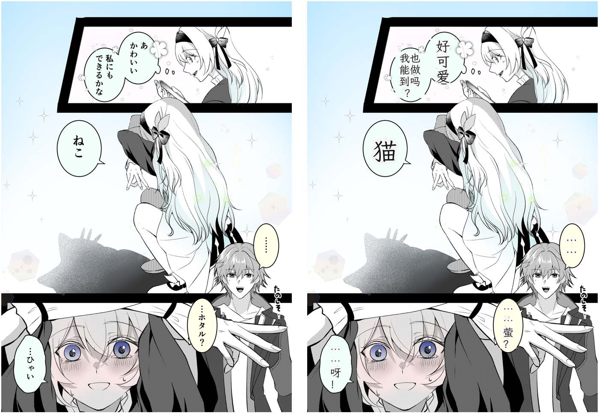

一个日漫图片翻译服务，支持将日文气泡文本自动翻译并回填为中文。

## 项目效果

示例效果：




## 项目部署与使用

### 1. 环境准备

- 手动命令行方式：Python `3.12` + `uv`
- Windows（x64）`start.cmd` / macOS（Apple Silicon，macOS 13+）`start.command`：无需预装 Python/uv。
- Mac 使用原生 PyTorch，Windows/Linux 保留 CUDA 12.6 构建；默认都使用 CPU，Windows 有兼容的 NVIDIA 显卡时可启用 GPU。
- 当前不支持 Intel Mac：锁定的 PyTorch 2.7.1 没有对应安装包。Mac 暂未接入 MPS 加速，保持 `MOEGAL_USE_GPU=0`。

### 2. 安装依赖

在项目根目录执行：

```bash
uv sync
```

首次启动下载较慢时，先看终端当前下载的内容：

- Python 依赖已默认使用清华源；Windows 的 CUDA 版 PyTorch 使用独立的 PyTorch 源，切换普通 Python 包镜像不会改变它的下载源。
- OCR 模型默认使用 `hf-mirror.com`，失败后本轮后续文件改用 Hugging Face 官方源。默认同时下载 2 个文件，可在 `.env` 设置 `MODEL_DOWNLOAD_WORKERS=1`～`8`。
- 元数据请求遇到临时连接中断（包括 TLS EOF）时会有限重试，证书校验保持开启。并发数控制的是不同文件；只剩一个大文件时，调高它不能加速该文件。
- 如果日志反复显示镜像不可用，而官方源能下载，可在 `.env` 设置 `HF_ENDPOINT=https://huggingface.co`、`HF_FALLBACK_ENDPOINT=https://hf-mirror.com` 后重新启动。已有环境变量的优先级高于 `.env`。
- 保留 `assets/models/`（包括里面的 `.cache/`）和 `.cache/uv/`，重试会复用已完成文件及下载缓存。也可从已完成模型下载的电脑复制整个 `assets/models/`；模型文件可在 Mac 和 Windows 间共用，`.venv` 不能跨系统复制。

### 3. 配置环境变量

在根目录复制 `.env.example` 为 `.env`，然后编辑 `.env`（一键启动脚本会在文件不存在时自动创建，不覆盖已有配置）。

```bash
# macOS / Linux；已有 .env 时不要覆盖
cp -n .env.example .env
```

翻译接口相关配置可以先留空，服务仍可正常启动；实际翻译时，插件 popup 和翻译按钮会提示补充配置。

```env
# 自定义接口方案（OpenAI 兼容）
CUSTOM_API_KEY=your_custom_api_key
# 可选，不填则使用代码默认值
CUSTOM_BASE_URL=https://api.openai-proxy.org/v1
CUSTOM_MODEL=gpt-5-mini

# DashScope 方案
DASHSCOPE_API_KEY=your_dashscope_api_key
# 可选，不填则使用代码默认值
DASHSCOPE_BASE_URL=https://dashscope.aliyuncs.com/compatible-mode/v1
DASHSCOPE_MODEL=qwen3-max
```

说明：
- 默认配置为 `custom + parallel`。
- 运行时可通过配置接口切换供应商与翻译模式（见下文）。
- 若当前供应商未配置 Key，服务不会启动失败，但在 popup 配置页和实际翻译时会提示需要填写对应 `.env`。
- 为了保证首次启动稳定，OCR 默认使用 CPU。`MOEGAL_USE_GPU=1` 可指定服务启动时默认选择 GPU，也可直接在浏览器插件 popup 中随时切换 CPU/GPU；下一次翻译会按新设备重新加载 OCR 模型。若驱动或显卡不兼容，会自动回退 CPU 并在 popup 中提示。

### 4. 启动服务

```bash
uv run uvicorn app.main:app --reload
```

**一键启动：**

- Windows：双击根目录 `start.cmd`。
- Mac（M 系列芯片）：双击根目录 `start.command`，或在终端运行 `./start.command`。
- 如果下载 ZIP 后 Mac 脚本没有执行权限，在项目目录执行 `chmod +x start.command` 后重试；也可运行 `bash start.command`。
- 首次启动时，两个脚本会在项目目录内自动准备 `uv`、Python `3.12` 和依赖，并在缺少 `.env` 时从示例创建。
- 以后双击 `start.cmd` / `start.command` 直接使用已有环境，不检查 Git 更新，也不同步依赖。只有点击更新脚本才检查新版；模型文件若还没下载完整，仍需要继续补齐。
- 本地运行时目录为 `.tools/`、`.python/`、`.venv/`，依赖缓存位于 `.cache/uv/`。
- 首次运行需要联网下载工具、依赖与 OCR 模型。模型保存在 `assets/models/`，后续启动复用已有文件。
- 服务就绪后访问 `http://127.0.0.1:8000/docs` 测试接口，保持终端开启，按 `Ctrl+C` 停止服务。
- M 系列 Mac 请使用原生终端运行，不要启用 Rosetta 模式。

兼容入口也可用：

```bash
uv run uvicorn main:app --reload
```

### 4.1 一键更新并启动

- Windows：双击 `update.cmd`。
- Mac：双击 `update.command`，或运行 `bash update.command`。若缺少执行权限，运行 `chmod +x update.command`。
- 更新需要 Git，并使用当前分支配置的上游分支；通过 ZIP 下载的目录会跳过自动更新，继续启动本地版本。
- 有新版且可以快进合并时自动更新，然后通过 `start.cmd --sync` / `start.command --sync` 同步依赖、启动服务。
- 已是最新版，或网络失败、认证失败、拉取超时、有本地修改、分支分叉时，直接使用已有 `.venv` 启动，跳过工具下载与依赖同步。不会自动 stash、强制重置代码或覆盖已有的忽略文件（如 `.env`）。
- 使用前先停止正在运行的服务；首次运行且尚无本地环境时，仍会进入正常初始化流程，需要联网。已有 OCR 模型会复用，缺失模型和实际翻译接口仍需要网络。

普通启动已默认复用现有环境，原来的 `--local` 参数仍兼容：

```bash
# macOS
bash start.command --local
```

```bat
:: Windows
start.cmd --local
```

手动修改依赖后需要同步环境时，可显式运行 `bash start.command --sync` 或 `start.cmd --sync`。


### 5. 调用接口

1. 上传图片翻译

```bash
curl -X POST "http://127.0.0.1:8000/api/v1/translate/upload" \
  -F "img=@./assets/pics/example1.png"
```

如不需要返回 `res_img`（base64，体积较大），可关闭：

```bash
curl -X POST "http://127.0.0.1:8000/api/v1/translate/upload?include_res_img=false" \
  -F "img=@./assets/pics/example1.png"
```

如需竖排回填，可传 `text_direction=vertical`：

```bash
curl -X POST "http://127.0.0.1:8000/api/v1/translate/upload?text_direction=vertical" \
  -F "img=@./assets/pics/example1.png"
```

2. 通过图片 URL 翻译

```bash
curl -X POST "http://127.0.0.1:8000/api/v1/translate/web" \
  -H "Content-Type: application/json" \
  -d '{
    "image_url": "https://example.com/xxx.png",
    "referer": "https://example.com",
    "include_res_img": false,
    "text_direction": "vertical"
  }'
```

2.1 通过 Canvas 导出的 base64 图片翻译

```bash
curl -X POST "http://127.0.0.1:8000/api/v1/translate/web" \
  -H "Content-Type: application/json" \
  -d '{
    "image_base64": "data:image/png;base64,iVBORw0KGgoAAAANSUhEUgAA...",
    "referer": "https://example.com",
    "source_type": "canvas",
    "include_res_img": false,
    "text_direction": "vertical"
  }'
```

说明：
- `image_url` 与 `image_base64` 必须且只能传一个。
- `image_base64` 当前仅支持完整的 `data:image/png;base64,...` 格式。
- `text_direction` 可选值为 `horizontal`（默认）和 `vertical`。
- 成功响应中的 `res_img` 仍然是不带 Data URL 前缀的纯 base64 字符串。

### 5.1 性能相关参数（可选）

可通过环境变量限制 OCR 并发线程数（默认 `2`）：

```env
OCR_MAX_CONCURRENCY=2
```

`/api/v1/translate/web` 的 JSON 请求体默认最大限制为 `20 MiB`，可通过环境变量调整：

```env
TRANSLATE_WEB_MAX_BODY_BYTES=20971520
```

如果服务前面有 Nginx、Caddy 或其他反向代理，需要同步放宽对应的请求体大小限制，否则大尺寸 `canvas` PNG 可能会在到达应用前被代理直接拦截。

### 5.2 文字擦除与彩色背景修复

擦除会覆盖文字的细笔画、标点和抗锯齿边缘，同时识别深色、浅色及彩色文字。确认是纯色的气泡会直接补回采样的背景色；渐变、网点和画面背景则交给图像修复。只修改文字掩码覆盖的像素，不直接涂满整个检测框。

背景修复固定使用 OpenCV，无需额外下载擦除模型或在前端选择方法。半透明气泡会区分文字主体与浅色背景线，并在填色前复核背景，减少漏擦和误擦。复杂花字或与画面线条重叠的区域仍可能出现修复痕迹。

### 5.3 配置接口

```bash
# 初始化为默认配置（custom + parallel）
curl -X POST "http://127.0.0.1:8000/conf/init"

# 查询当前配置
curl "http://127.0.0.1:8000/conf/query"

# 查看可选项
curl "http://127.0.0.1:8000/conf/options"

# 更新配置示例：切换到 custom
curl -X POST "http://127.0.0.1:8000/conf/update" \
  -H "Content-Type: application/json" \
  -d '{"attr":"translate_api_type","v":"custom"}'

# 更新配置示例：切换到 dashscope
curl -X POST "http://127.0.0.1:8000/conf/update" \
  -H "Content-Type: application/json" \
  -d '{"attr":"translate_api_type","v":"dashscope"}'

# 更新配置示例：切换 structured 模式
curl -X POST "http://127.0.0.1:8000/conf/update" \
  -H "Content-Type: application/json" \
  -d '{"attr":"translate_mode","v":"structured"}'

# 更新配置示例：启用 GPU（传 false 可切回 CPU）
curl -X POST "http://127.0.0.1:8000/conf/update" \
  -H "Content-Type: application/json" \
  -d '{"attr":"use_gpu","v":true}'

```

`/conf/query`、`/conf/init`、`/conf/update` 的返回中会额外带上 `provider_status` 和 `gpu_status`，用于提示当前供应商和计算设备的可用状态。例如：

```json
{
  "translate_api_type": "custom",
  "translate_mode": "parallel",
  "use_gpu": true,
  "gpu_status": {
    "requested": true,
    "available": false,
    "device": "cpu",
    "models_loaded": false,
    "message": "GPU 不可用，将自动使用 CPU：torch.cuda.is_available() = False"
  },
  "provider_status": {
    "custom": {
      "configured": false,
      "message": "当前自定义翻译接口未配置，请在后端 .env 中填写 CUSTOM_API_KEY"
    },
    "dashscope": {
      "configured": true,
      "message": ""
    }
  }
}
```

### 6. 输出文件

处理后的文件默认保存到：
- `saved/raw/`：原图
- `saved/cn/`：中文回填图

## 项目结构

```text
app/
  api/
    routes/
      manga_translate.py   # 翻译接口
      update_conf.py       # 运行时配置接口
  services/
    ocr.py                 # 模型加载与 OCR
    translate_api.py       # 翻译供应商调用逻辑
    pic_process.py         # 图像处理与文本回填
    text_erasure.py        # 文字掩码与纯色气泡填充
    inpainting.py          # OpenCV 背景修复
  core/
    custom_conf.py         # 运行时配置管理
    font_conf.py           # 字体配置
    logger.py              # 日志
    paths.py               # 路径常量
  main.py                  # FastAPI app 创建入口

assets/
  models/                  # 检测与 OCR 模型
  fonts/                   # 绘制中文字体
  pics/                    # 示例图片

saved/                     # 输出目录（raw/cn）
logs/                      # 运行日志
main.py                    # 兼容入口（from app.main import app）
```
